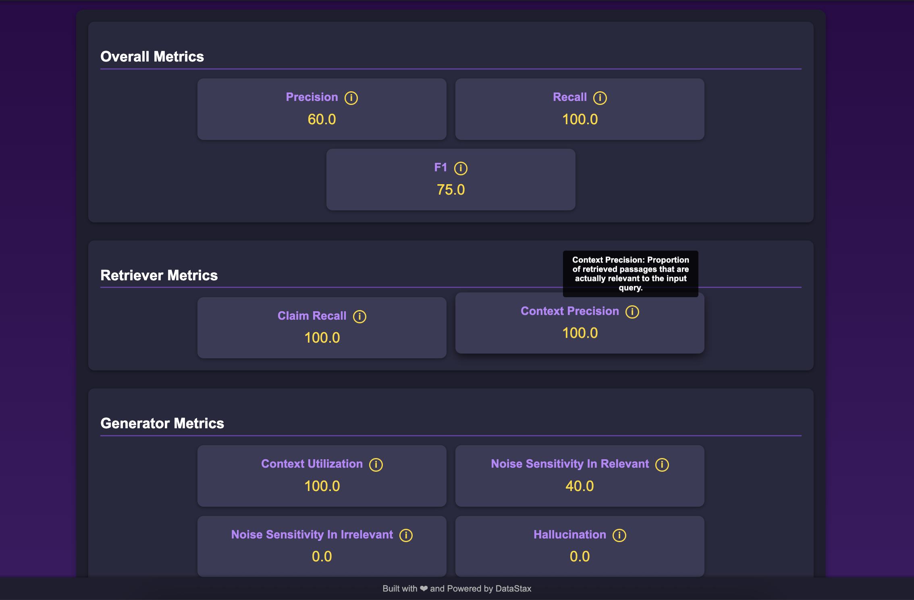
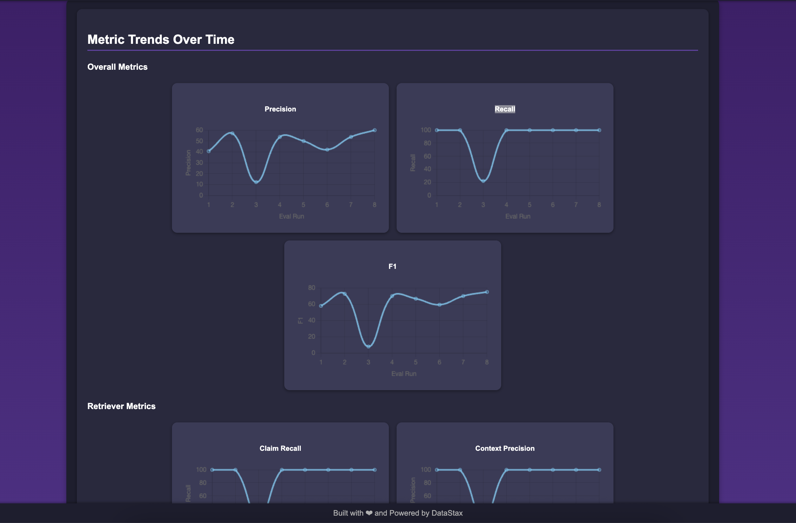

# Ground Truth Generator and RAG Evaluator 

This repository provides a library to simplify the generation of ground truth datasets and the evaluation of Retrieval-Augmented Generation (RAG) applications
. 
It aims to assist developers in building and testing RAG applications with better relevance by bootstraping with LLM generated ground truth dataset and RAGChecker evaluation metrics.

## Table of Contents

- [Introduction](#introduction)
- [Features](#features)
- [Prerequisites](#prerequisites)
- [Installation](#installation)
- [Usage](#usage)
  - [Generate Ground Truth Data](#generate-ground-truth-data)
  - [Evaluate RAG Application](#evaluate-rag-application)
  - [View Evaluation Metrics](#view-evaluation-metrics)
- [Framework Overview](#framework-overview)
- [AstraDB Integration](#astradb-integration)
- [Contributing](#contributing)
- [License](#license)

## Context

Building RAG applications for testing is straightforward. However, developing production-ready RAG applications with high relevance requires grounding with organizational data, which can be challenging. Developers often face difficulties in:

- **Creating Ground Truth Datasets**: Developers find creating ground truth dataset difficult. Manually building datasets is time-consuming and prone to errors.
- **Evaluating RAG Applications**: Assessing applications in terms of accuracy, relevance, hallucination, etc.
- **Data Management**: Storing and updating ground truth datasets efficiently.

## Features

- **Automated Ground Truth Generation**: Generate datasets from your documents using a LLM
- **Comprehensive Evaluation Metrics**: Evaluate applications on accuracy, relevance, hallucination, and more (RAGChecker).
- **AstraDB Storage**: Store and manage your datasets directly in AstraDB.
- **Integrated with Phoenix Arize**: For Tracing and Monitoring your application.
- **Flask Web Interface**: Visualize evaluation metrics via a simple web application.
- **Metrics Visualization**: Visualize evaluation metrics through an interactive web interface.
- **Troubleshooting Guide**: Provides solutions for common issues encountered during setup and usage.
- **Advanced AstraDB Usage**: Offers tips for optimizing AstraDB queries and ensuring data integrity.

## Prerequisites

- Python 3.7 or higher
- OpenAI API Key
- AstraDB Application Token and Endpoint
- Required Python packages (see `requirements.txt`)

## Installation

1. **Clone the Repository**

   ```bash
   git clone https://github.com/shiragannavar/Testing-RAG.git
   cd testing-rag
   ```

2. **Install Dependencies**

   ```bash
   pip install -r requirements.txt
   ```

3. **Set Up Environment Variables**

   Create a `.env` file in the root directory and add the following:

   ```env
   OPENAI_API_KEY=your_openai_api_key
   ASTRA_DB_APPLICATION_TOKEN=your_astradb_token
   ASTRA_DB_API_ENDPOINT=your_astradb_endpoint
   ```

## Usage

```python
python -m main_client.py
```

### Metrics Visualization

To visualize the evaluation metrics, a Flask web application is provided. Follow these steps to set it up:

1. Ensure all dependencies are installed as per the `requirements.txt`.
2. Run the Flask application using the command:

   ```bash
   python main_client.py
   ```

3. Open your web browser and navigate to `http://localhost:5001/` to view the evaluation metrics.

### Troubleshooting

- **Common Issue 1**: If you encounter an error related to missing environment variables, ensure that your `.env` file is correctly set up with the necessary API keys and tokens.
- **Common Issue 2**: If the Flask application does not start, check if the port 5001 is already in use or try running the application on a different port.

## Code Explanation

### Generate Ground Truth Data

Use/Modify the `groundtruth.ground_generator` module to generate ground truth question-answer pairs from your documents.

```python
import groundtruth.ground_generator as gg

# Sample documents
movies = [
    {
        "id": 653346,
        "title": "Kingdom of the Planet of the Apes",
        "content": "Several generations following Caesar's reign, apes – now the dominant species – live harmoniously while humans have been reduced to living in the shadows..."
    },
    {
        "id": 573435,
        "title": "Bad Boys: Ride or Die",
        "content": "After their late former Captain is framed, Lowrey and Burnett try to clear his name, only to end up on the run themselves..."
    }
]

# Extract content
texts = [movie["content"] for movie in movies]

# Generate ground truth data
qa_list = gg.generate_ground_truth(
    texts,
    save_to_AstraDB=True,
    save_to_file=True
)

print(qa_list)
```

This code:

- Extracts the `content` field from each movie in the `movies` list.
- Generates question-answer pairs using the `generate_ground_truth` function.
- Saves the generated pairs to a CSV file (`qa_output.csv`) and stores them in AstraDB.

### Evaluate RAG Application

Use the `eval.rag_checker` module to evaluate your RAG application.

```python
import eval.rag_checker as rc

chain = rc.get_default_rag_chain( astradb_collection='movies')
project_name = f"my-eval-app.{time.time()}"
ragchecker_file = "ragchecker_input.json"
metrics_file_name = "metrics.json"
ground_truth_file = "qa_output.csv"

session = rc.start_phoenix_session(project_name=project_name)
rc.run_eval(chain, ground_truth_file)
rc.get_ragchecker_input(session=None, 
                        phoenix_project_name=project_name, 
                        ground_truth_file=ground_truth_file,
                        ragchecker_file=ragchecker_file)
rc.compute_ragchecker_metrics(input_file_name=ragchecker_file, 
                              metrics_file_name=metrics_file_name)
```

This code:

- Initializes a RAG chain that retrieves context from AstraDB.
- Starts a Phoenix session for tracing and monitoring the evaluation process.
- Runs the evaluation using the ground truth data from `qa_output.csv`.
- Generates an `output.json` file containing the evaluation results.
- Runs RAGChecker evaluator and saves the metrics to a file

### View Evaluation Metrics

Use the following code to display the metrics via a Flask web application.


```python
from flask import Flask, render_template
import json

# Flask application
app = Flask(__name__)

@app.route("/")
def display_metrics():
    # Read metrics from the temporary file
    with open(temp_file.name, "r") as f:
        metrics = json.load(f)
    return render_template("metrics.html", metrics=metrics)

if __name__ == "__main__":
    # Ensure Flask app starts after the rag_results are processed
    app.run(debug=False)
```

This code:

- Loads the evaluation results from `output.json`.
- Uses `RAGChecker` to compute various evaluation metrics.
- Saves the metrics to a temporary JSON file.
- Sets up a Flask web application to display the metrics.

Run the Flask app and navigate to `http://localhost:5000/` to view the evaluation metrics.


## Example Visualization

Below is an example of how the evaluation metrics and the historical visualization would look:




## AstraDB Integration

AstraDB is used as the ground truth dataset store, allowing developers to store and update the grounding dataset as new data is added to the knowledge repository.

- **Setup**:
  - Ensure you have an AstraDB account and obtain the application token and API endpoint.
  - Set the environment variables `ASTRA_DB_APPLICATION_TOKEN` and `ASTRA_DB_API_ENDPOINT` in your `.env` file.

- **Advanced Usage**:
  - For large datasets, consider optimizing your AstraDB queries to improve performance.
  - Use AstraDB's built-in features for data replication and backup to ensure data integrity.

## Environment Setup

Ensure your `.env` file in the root directory includes the following variables:

```env
OPENAI_API_KEY=your_openai_api_key
ASTRA_DB_APPLICATION_TOKEN=your_astradb_token
ASTRA_DB_API_ENDPOINT=your_astradb_endpoint
```

## Contributing

Contributions are welcome! Please open an issue or submit a pull request for any improvements or suggestions.

## License

This project is licensed under the Apache-2.0.

---

By using this framework, developers can focus on improving their RAG applications without worrying about the complexities of data generation and evaluation. It streamlines the entire process, from generating ground truth data to evaluating application performance, making it easier to build high-accuracy, production-ready RAG applications.
